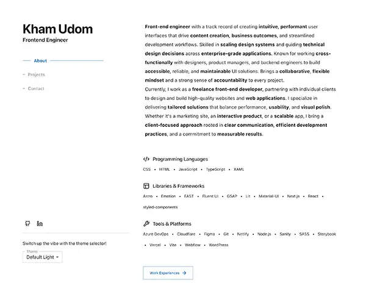

# Kham Udom - Portfolio Website

A modern, responsive portfolio website showcasing the work and skills of Kham Udom, a Senior Front-End Engineer specializing in enterprise applications and design systems.

🌐 [Live Website](https://kham.website/)



## 🚀 Features

- **Responsive Design**: Fully responsive layout that works on all devices
- **Dark/Light Mode**: Toggle between dark and light themes
- **Project Showcase**: Detailed project pages with galleries and tech details
- **Lazy Loading**: Images load as they enter the viewport for better performance
- **Animations**: Smooth animations powered by GSAP
- **Accessibility**: Built with a11y best practices in mind
- **Performance Optimized**: Fast loading times and smooth interactions
- **Server-Side Rendering**: Built with Next.js for optimal performance

## 📋 Pages

- **Home**: Introduction and featured projects
- **About**: Professional background, skills, and experience
- **Work**: Complete portfolio of projects with filtering
- **Contact**: Contact form and information
- **Project Detail**: In-depth look at individual projects

## 🛠️ Tech Stack

- **Next.js 14.1.0**: React framework for production
- **React 18.3.1**: UI library
- **TypeScript 5.3.3**: Type-safe JavaScript
- **Material UI 5.15.10**: Component library and theming
- **GSAP 3.12.5**: Advanced animations
- **Lucide React 0.511.0**: Beautiful, consistent iconography
- **React Intersection Observer 9.8.1**: For lazy loading and scroll animations
- **Emotion 11.11.3**: CSS-in-JS styling solution
- **ESLint 8.56.0**: Code quality and style enforcement

## 🏗️ Project Structure

```
src/
├── app/            # Next.js app directory
├── components/     # Reusable UI components
├── context/       # React context providers
├── data/          # Data models and mock API
├── design-system/ # Design system components
├── hooks/         # Custom React hooks
├── styles/        # Global styles
├── types/         # TypeScript interfaces
└── utils/         # Utility functions
```

## 🎨 Design System

The project uses Material UI with a custom theme:

- Typography scale
- Color palette with light/dark mode variants
- Spacing system
- Component patterns
- Custom theme configuration

## 🔍 SEO & Performance

- Next.js built-in SEO features
- Meta tags and descriptive page titles
- Alt text for images
- Server-side rendering for better indexing
- Optimized images and assets
- Edge network deployment for optimal performance
- Vercel deployment configuration for production

## 📄 License

This project is licensed under the MIT License - see the LICENSE file for details.

## 🙏 Acknowledgments

- Icons from [Lucide](https://lucide.dev)
- Design inspiration from Material UI
